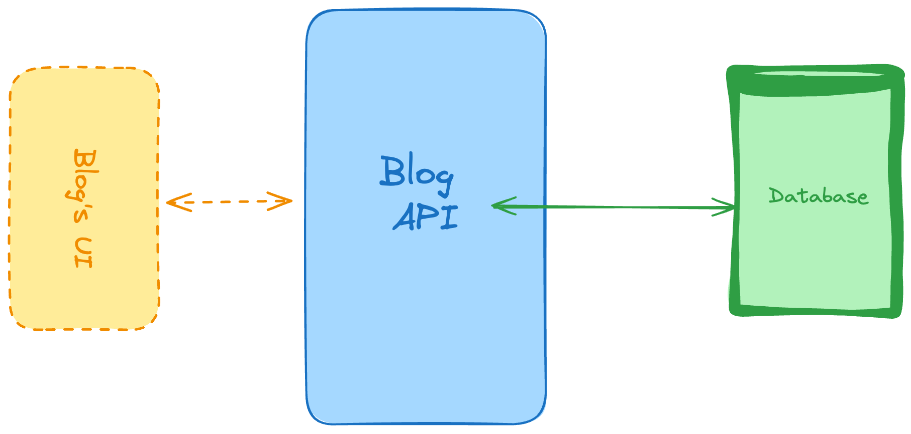

# 1. Personal Blogging Platform API

### Difficulty: Easy

Skills and technologies used: CRUD for main operations, databases (SQL or NoSQL), server-side RESTful API.

### Blogging Platform API

Let’s start with a very common one when it comes to backend projects.

This is a RESTful API that would power a personal blog. This implies that you’d have to create a backend API with the following responsibilities:

Return a list of articles. You can add filters such as publishing date, or tags.
Return a single article, specified by the ID of the article.
Create a new article to be published.
Delete a single article, specified by the ID.
Update a single article, again, you’d specify the article using its ID.
And with those endpoints you’ve covered the basic CRUD operations (Create, Read, Update and Delete).

As a recommendation for techstack, you could use Fastify as the main backend framework if you’re going with Node, or perhaps Django for Python or even Ruby on Rails or Sinatra for Ruby. As for your database, you could use MongoDB if you want to try NoSQL or MySQL if you’re looking to get started with relational databases first.